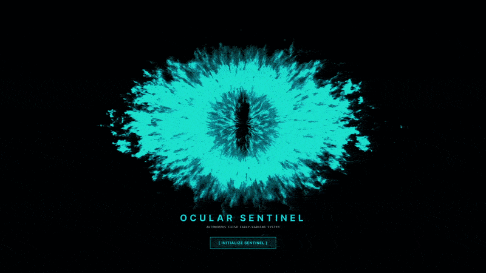
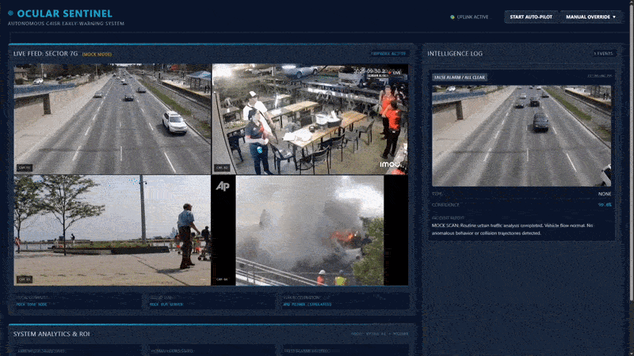

# Ocular Sentinel

> **🏆 Built for the AMD Developer Hackathon: Act II — Track 3 (Unicorn Track)**  
> *Developed independently in 24 hours.*

<br/>

<div align="center">
  
  <br/><br/>
  
</div>

<br/>

Ocular Sentinel is an AI-powered Autonomous C4ISR Security System that combines the speed of edge detection with the deep reasoning of cloud Vision-Language Models (VLMs). 

It continuously monitors video feeds (CCTV, Dashcams, Drones) using a local **YOLO11n Edge Tripwire**, which buffers frames in memory. When a potential anomaly or threat is detected, the system compiles the buffered footage and beams it to a **Qwen2-VL** multimodal model to generate a rich, contextual incident report.

## Dual-Purpose C4ISR Methodology
Ocular Sentinel is built as a flexible **B2B (Business-to-Business)** and **B2G (Business-to-Government)** solution:
- **B2B Deployments**: Commercial property security, retail loss prevention, warehouse logistics monitoring, and industrial safety (e.g., detecting fires or unauthorized access).
- **B2G Deployments**: Highway traffic management, autonomous vehicle integration, border patrol, and tactical drone surveillance.

## Total Addressable Market (TAM)
The intersection of Edge AI and Video Analytics targets a massive and rapidly expanding market. The global Video Surveillance market is projected to reach **$83.3 Billion by 2030**, while the broader AI in Computer Vision market is expected to surpass **$200 Billion by 2030**. Ocular Sentinel captures value across these sectors by drastically reducing the human capital required for 24/7 C4ISR (Command, Control, Communications, Computers, Intelligence, Surveillance, and Reconnaissance) monitoring.

## Why VLM Instead of Traditional CV?
Traditional Computer Vision (CV) pipelines rely on narrowly trained classification models (like YOLO or ResNet) that can only detect what they have been explicitly trained to see (e.g., "Person", "Car", "Backpack"). They lack **contextual reasoning**.

By integrating a **Vision-Language Model (VLM)** like Qwen2-VL, Ocular Sentinel achieves true cognitive surveillance:
1. **Zero-Shot Anomaly Detection**: A VLM doesn't need to be pre-trained on an "Earthquake" or "Store Robbery" bounding box dataset. It intuitively understands that a building shaking or a person wielding a knife is a threat through zero-shot contextual reasoning.
2. **Tactical Reporting**: Instead of merely outputting a bounding box labeled `person: 0.95`, the VLM synthesizes the entire scene, describing the severity of the threat, the environment, and recommending human-readable tactical actions.
3. **Conversational C4ISR**: Operators can dynamically query the system ("Is anyone trapped in the vehicle?", "Are the suspects armed?") rather than relying on static dashboard metrics.

## Architecture
- **Frontend**: React (Vite) + Tailwind CSS dashboard providing a cyberpunk-styled command center.
- **Backend**: FastAPI (Python) managing WebSockets, the YOLO inference thread, and video streaming.
- **VLM Node**: Jupyter Notebook running the Qwen2-VL model (optimized for AMD ROCm via vLLM and targeted for AMD AI Notebook/AMD Instinct MI300X accelerators on the AMD Developer Cloud), exposed securely via an Ngrok tunnel.

## Quick Start

### 1. Start the VLM Server (Cloud Node)
If you are running the VLM on a separate AMD ROCm machine or notebook environment:
1. Open `Ocular_Sentinel_VLM.ipynb`
2. Enter your Ngrok Auth Token in the designated cell.
3. "Run All" cells.
4. Note the generated `ngrok-free.dev` URL.

### 2. Start the Edge Tripwire (Backend)
Navigate to the `backend/` directory:
```bash
cd backend
pip install -r requirements.txt
```
Set the VLM API URL environment variable and run the server:
```powershell
$env:VLLM_API_URL="https://YOUR_NGROK_URL.ngrok-free.dev/v1"
python main.py
```
*(The backend runs on `http://localhost:8000`)*

### 3. Start the Command Center (Frontend)
In a new terminal window, navigate to the `frontend/` directory:
```bash
cd frontend
npm install
npm run dev
```
*(The frontend runs on `http://localhost:5173`)*

## Features
- **Rolling Frame Buffer**: Captures the moments *before* and *after* a threat is detected.
- **Auto-Pilot Mode**: Automatically cycles through security feeds and autonomously investigates anomalies.
- **Real-Time WebSockets**: Instant bidirectional communication between the VLM, the Tripwire Engine, and the Command Center Dashboard.
- **AMD ROCm Support**: Native compatibility for AMD GPUs via `vllm`.
